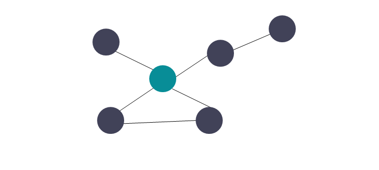
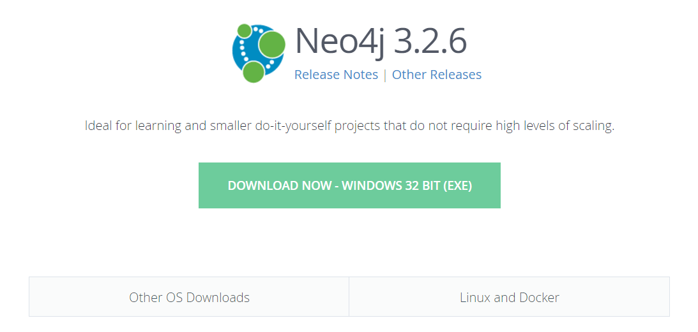

# Graph databases and visualisation using Neo4j

# Topics

## What are graphs?
Graphs are a type of structure used to understand the relationships between a set of objects. A graph is made up of a series of objects called nodes/vertices and a set of relationships between them called edges. The node objects and edges can contain information within them referred to as properties. The nodes are represented by circles and the relationships are represented by the lines. There can be different types of objects which are illustrated below by different node colours. 

## What is a graph database and why do we use them?
Most of the data warehouses we work with at the SIA are relational. These are a set of highly structured tables that are joined together via primary keys and foreign keys. Joins are carried out once the query is run. Relational databases are not suited for modelling networks of highly connected objects. For exmaple, if you were looking at friends of friends you would need several many to many recursive joins to capture this in a relational database. This increases query latency. A relational database will have complexity proportional to the cardinality of the tables O(|A|+|B|) - hash join O(|A|*|B|) - nested loop join O(???) index join - will depend on the number of pages in the index I guess

Graph databases have a different structure. Relationships are stored at the individual level. Nodes are linked to each other in the graph database directly in the storage so no lookups are necessary this reduces the run time of queries significantly as the networks gets larger and more connected Neo4j has O(k) complexity where k is the number of edges. 

[Neo4j](https://neo4j.com/) is a popular graph database tool and is what the M&I team have used for proof of concepts.

## Tools for visualising graphs
There are also numerous ways to visualise graphs. Some tools are purely for visualisation while others are both graph databases with visualisation tools available. An example of some visualisation tools are listed below 

* [igraph](http://igraph.org/r/)
* [titan](http://titan.thinkaurelius.com/)
* [neo4j](https://neo4j.com/)
* [gephi](https://gephi.org/)
* [visNetwork](https://cran.r-project.org/web/packages/visNetwork/vignettes/Introduction-to-visNetwork.html)

M&I have kept with using neo4j for proof of concept visualisation. 

There are many other examples available. For instance, Compass have created a [Knowledge Lab shiny app](https://compassnz.shinyapps.io/knowlabshiny/) that uses `visNetwork` to display a graph. The code can be found [here](https://github.com/kcha193/KnowLabShiny). Of particular interest is the `base` folder which uses a set of csv to store the nodes and edges. A screenshot of the Knowledge Lab graph visualisation is shown below. Here the nodes represent outcomes and indicators while edges represent causal inferences. Each edge properties showing the literature and the magnitude of the effects.

## Graph demo using Neo4j
The M&I team created a proof of concept to model an outcomes framework. The team found that several spreadsheets existed but the row/column nature of the spreadsheets masked the number of indicators actually available. The Superu framework for instance appears to have almost 800 indicators. However, it turned out that most projects were using the same indicators. Once the duplicates were removed there were fewer than 200 indicators remaining. The team decided that it would be great to take this spreadsheet and visualise it using a graph structure so that all the relationships between could be seen. For such a small number of indicators a graph database was not necessary but it was used as a proof of concept to illustrate how larger more connected networks could be constructed in a graph database.

Some of the example queries and outputs are based on that proof of concept outcomes framework.

### Installing Neo4j
Currently we do not have an Enterprise edition of Neo4j as this was just a proof of concept. To download a community edition follow these steps.

1. Go to the [Neo4j download page](https://neo4j.com/download/) and click on the download community edition button. This will detect your OS and produce another button that looks something like this: 

2. Click on the download now button which will download the exe file.
3. Open the exe file. A security warning will pop up asking if you want to run the file. Click `Run`.
4. If you get any security warning windows popping up then click on `Allow this file` and Click `Ok` to add it to the exception list
5. An install window will pop up. Wait for it to reach 100%
6. Select a destination. We will put this in our scratch space as we do not have admin permissions to store the program in the Program Files area. Once you have selected this area click on `Next`.
7. A welcome page pops up again click on `Next`.
8. Accept the license agreement and click `Next`.
9. Create a start menu folder and click `Next`.
10. Installation will start. When this has been completed click the `Finish` button.
11. When you first start Neo4j you will need to select a directory to store the graph database. Again put this in your scratch space in a folder separate from the Neo4j program folder.
12. Click the `Start` button. The status button will turn yellow with a message that Neo4j will be ready shortly. When the status bar turns green Neo4j is ready. Click on the url address to open Neo4j.

**Important:** Once you have finished getting Neo4j take a look at the [web page](https://neo4j.com/download-thanks/?edition=community&release=3.2.6&flavour=windows&_ga=2.228746396.10630933.1508098086-1967205726.1508098086). It has gone from a download Neo4j page to a thanks for downloading Neo4j page. This has your username and password, download instructions and a demo/tutorial. When you log on you will be prompted to change your password. 

### Creating a graph database

### Querying a graph database
The cypher is a graph query language that makes it easy to query relationships in graphs. Two clauses used a lot that you dont find in relational database query languages  are `match` and `return`.

Last updated Oct-2017 by VB and EW

