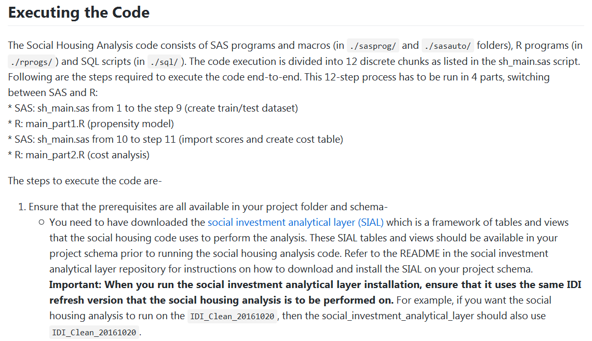
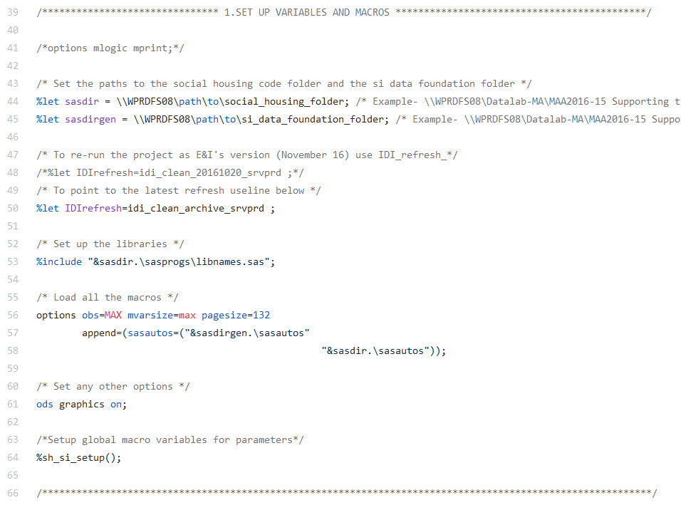
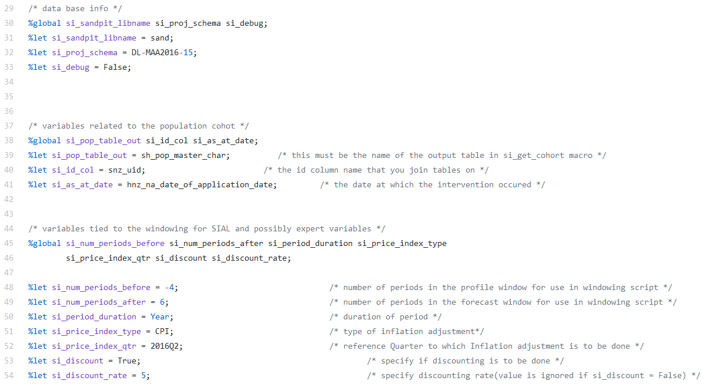
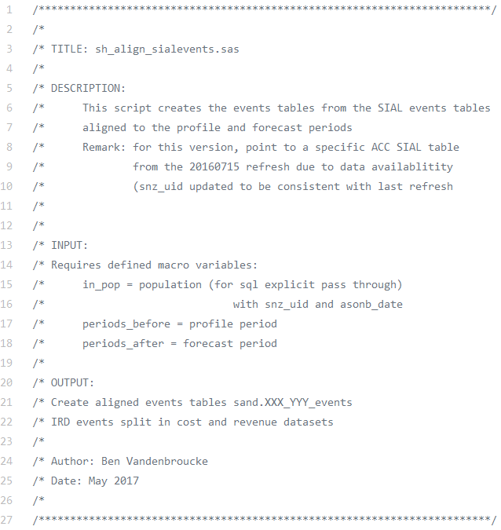
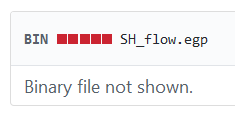

# Critique of our Coding Style

## Thoughts on minimum code sharing data standards – using the SIA social housing code as an example of the good, the bad and the ugly

The Social Investment Agency Evidence and Insights (E&I) team consists of 9 people who regularly write code for our ever growing set of reusable tools. Writing code is one thing, but when you have to make sure the rest of the team can follow it, the code runs error free and is easy to debug - that is an entirely different kettle of fish that requires coding standards.

Originally the coding standards were in the heads of the original E & I members and were lost in some email trail. Recently the E&I team spent time discussing and committing the standards to paper (or should I say html).

Some of our repositories were developed prior to the official guidelines being published so we thought it would be a good idea to review one of these repositories to see what was done well and what could be improved. We chose to look at the social housing repository.

### There were several things done well with the social housing code

#### Version control allows you to track changes, correctly version code and collaborate with others
Placing your code online in a place like Github means that anyone can see your code. The social housing code is in its infancy meaning it has not had many collaborators or versions. If it grows bigger it will start to look something like this.

Bugs with the code can easily be raised by the issues, you can see exactly what changes have been made with every commit and which contributors made the changes. Our code base is constantly evolving so we make use of releases so that people know which version of the code they are downloading.

#### Readmes are the first place we look for information about the repository and how to run the code

The social housing code has step by step instructions in the readme about how to run the code as well as dependencies. That means that any new people joining the team will understand what this code is for and how to run it. The steps are extremely detailed which is great.

#### Parameterising everything means that anyone can rerun the code
We share our code with the intention that people outside the SIA should be able to use the code if they please. In order for this to happen, all the variables are parameterised.

Note that file paths are set up to be relative by making use of macro variables `sasdir` and `sasdirgen`. This means that there are only two file paths that need to be specified. These are at the top of the script where they can clearly be seen. Once a user has specified them they don’t need to worry about getting access denied errors when they try to access a file directory they don’t have access to.

The number of macro variables may look like overkill but this ensures that all our macros can be reused again and again rather than having to write similar looking but slightly different scripts each time.

#### Modular code means that the code can be reused across multiple projects
The SIA has created code in such a way that enables easy reuse across projects. This reduces the number of components to be created for each new project.

The social housing code makes use of reusable code pieces from the social investment data foundation repository. Instead of rewriting the code the social investment data foundation is a dependency and then the macros are called.

**Tips for power users:** Git allows for submodules which can be used to handle dependencies with other products/tools.  

### There are several things that could be improved with the social housing code

#### Headers are a great way to explain what the script is supposed to do and other things you should be aware of but make sure you have the right detail in them and they are all completed
Each script clearly denotes its purpose the inputs and outputs which makes it easier for others to follow and troubleshoot. However, some headers are not complete and there are a small number of scripts that are missing headers altogether.

The headers should ideally have a dependencies section so it is clear what this script depends on. 

Notes/issues with the code should also be raised here so that we have all the key info at our finger tips. Our original E&I headers had most of this info but a new member was not aware of this which highlights the need for standard header templates.

Our new standard headers can be found [here](https://nz-social-investment-agency.github.io/siu_analytical_processes/output/siu_coding_style_guide_v1.0.html)

#### The folder structure should be intuitive and only necessary files should be in the repository
Originally the repository was absent of a docs folder. We can tell this because Github keeps a history of all changes. We can see that the documentation was sitting in the top level of the repository.

It is great that someone spotted this, created a docs folder and shifted the documentation into that folder.

There are also cached image files in the repo these should not be here and need to be deleted.

If you have an empty folder that is where output will be placed when you run the code then put a readme.md file in it to ensure the folder ends up in the repository.

#### EG projects are not reusable and the SIA actively avoid them
The SIA do not use EG projects. The code is all designed to be modular and reused again and again. All reusable code is in macros or functions and sourced via a `sasautos` call for SAS and a `source` for R

To use `sasautos` you need one macro per script and the macro name must match the file name. We have dozens of macros we use so this is the most efficient way to load them all.

We use a main script to guide the flow between the code rather than an EG project. This script includes all the SAS programs and all the macro calls.

It is good that this file has been removed from the repository

#### Filenames should not have spaces and should not be ordered by ASCII names
We avoid spaces in file names like the plague. These have been mistaken as separators before in the command line and scripts which then need to be escaped properly. Instead we find it much easier to just use underscores instead of spaces.

Another problem with these file names is the numbering of them.

The scripts have been prefixed with numbers. We have had a situation in the past where we have had to renumber everything because we end up with a new script right in the middle. We have also picked up code where you need to run part of script 2 then run script 0 and then part of script 1 and then the rest of script 2. This is too hard to follow.

Our script orders are dictated by the main script not by their ASCII names. Since there is a main script and the scripts are sourced in order, numbering is redundant.

It is a lot easier to reshuffle the scripts in the main script as opposed to renaming all the scripts again.

#### Unit tests will help ensure the code is robust and easier to troubleshoot
No units tests are available in this project. Unit tests are great when you need to see how a macro runs and also when you need to troubleshoot code. Starting a new SAS session and reading in all the macros with a `sasautos` call will give you a clean slate to run your unit tests on to make sure your scripts are running correctly. Recently, for important pieces of code that are going to be reused a lot we have incorporated unit tests. An example can be found [here](https://github.com/nz-social-investment-agency/social_investment_data_foundation/blob/master/unittests/si_unit_test.sas).

#### Optimising the code will ensure better performance
The social housing code has not been fully optimised. Tuning the code could help improve the amount of time to run the code or the amount of memory consumed. Currently our coding guidelines require us to push our population tables into the database so that in-database processing can be done. Our small population datasets are left joined to the large administrative tables in the database which means only a small joined table is transferred over to SAS. This reduces the amount of IO required.

#### The social housing code had good features that enabled code sharing but there are things that could be improved to ensure it meets a minimum code sharing standard
Considering the code was rewritten by an external contractor at a time when we had no coding standards written down and no templates, the code was written quite well.  

The good

* It was great to see a version control tool like Github being used
* Readmes with step by step instructions are fantastic
* Parameterisation of key variables means that anyone can reuse the code
* Relative paths also help with the re-usability
* The code is modular meaning that the code could be reused in projects over and over again

The bad

* All scripts need to have headers that include all the key information such as inputs, outputs, dependencies and histories. Our new standard header can be found [here](https://nz-social-investment-agency.github.io/siu_analytical_processes/output/siu_coding_style_guide_v1.0.html)
* The folder structure should be intuitive and only necessary files should be in the repository. We actively think about the folder structure during the design phase prior to doing any coding
* The code could have been fully optimised for performance to improve processing time or memory usage. Currently, it is only partially optimised

The ugly

* EG projects do not help with re-usability. Ensure your code is modular and reusable by placing each macro in its own script with the file name matching the macro name and source them all via a `sasautos` call.
* One of the SIA’s coding conventions involves appropriate naming of file scripts. We avoid spaces in file names because they can cause problems in the command line and are annoying to escape. We also avoid numbering the scripts. Instead the order of execution is dictated by a main script. That way if you need to add a new script in the middle you don’t need to renumber everything. Having a main script also means that you can do testing to ensure that your code runs end to end using just one script. This makes it a lot easier for anyone new picking up the code.

So what does everyone think? Do you agree with the minimum viable product code sharing standards we have picked? If you have some others standards then please let us know.

